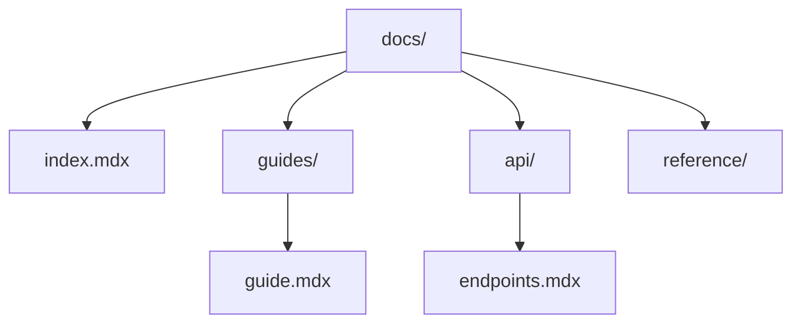

## Overview

Organize your Eyuel Documentation project to make it scalable and user-friendly. Structure pages hierarchically, leverage collaboration tools, track changes with versioning, and optimize search and navigation. Follow these practices to keep your docs maintainable as your project grows.

<Callout kind="tip">
  Start with a clear folder structure in your `docs/` directory to mirror your product's architecture.
</Callout>

## Project and Page Organization

Create a logical hierarchy for your documentation. Use folders for major sections like `guides/`, `api/`, and `reference/`. Each page requires YAML frontmatter with `title` and `description` for proper rendering.



<Columns cols={3}>
  <Card title="Folder Structure" icon="folder" href="#">
    Group related pages into folders. Limit depth to three levels for easy navigation.
  </Card>
  <Card title="Frontmatter" icon="file-text" href="#">
    Add metadata to every `.mdx` file. Use `title` and `description` for SEO and previews.
  </Card>
  <Card title="Navigation" icon="menu" href="#">
    Configure sidebar links in your theme settings to auto-generate menus.
  </Card>
</Columns>

<Steps>
  <Step title="Create Folders" icon="folder-plus">
    In your repo, add directories like `docs/guides/` and `docs/api/`.
  </Step>
  <Step title="Add Pages" icon="file-plus">
    Create `.mdx` files with frontmatter:

    ```yaml
    ---
    title: Your Page
    description: Page summary.
    ---
    ```
  </Step>
  <Step title="Link Pages" icon="link">
    Use relative paths: `[Guide](/guides/guide.mdx)`.
  </Step>
</Steps>

## Collaboration Features

Invite team members to edit docs directly. Eyuel supports real-time collaboration, comments, and pull requests for safe changes.

<Tabs>
  <Tab title="Git Workflow" icon="git-branch">
    Use branches for docs changes.

    <CodeGroup tabs="Bash,Git">
    ````bash
    git checkout -b docs-update
    git add docs/guide.mdx
    git commit -m "Update organization guide"
    git push origin docs-update
    ````

    ````git
    git checkout -b docs-update
    git add docs/guide.mdx
    git commit -m "Update organization guide"
    git push origin docs-update
    ````
    </CodeGroup>
  </Tab>
  <Tab title="Review Process" icon="eye">
    Assign reviewers in pull requests. Merge only after approval to maintain quality.
  </Tab>
</Tabs>

<Callout kind="info">
  Enable notifications for doc changes to stay in sync with your team.
</Callout>

## Versioning and History

Track changes with built-in versioning. Each edit creates a history entry, allowing rollbacks and comparisons.

<ExpandableGroup>
  <Expandable title="View Page History" default-open="true">
    Click the history icon next to any page title. Compare versions side-by-side and restore previous states.
  </Expandable>
  <Expandable title="Branch Versioning">
    Create doc versions tied to product releases, like `v1.0/` folders.
  </Expandable>
</ExpandableGroup>

## Search and Navigation

Enhance discoverability with full-text search and intuitive navigation. Eyuel indexes all pages automatically.

| Feature          | Description                          | Benefit                     |
|------------------|--------------------------------------|-----------------------------|
| Global Search    | Search across all docs by keyword.   | Quick access to content.    |
| Sidebar Menu     | Auto-generated from folder structure.| Easy hierarchical browsing. |
| Breadcrumbs      | Shows current path.                  | Clear context awareness.    |
| Tags and Filters | Categorize pages with metadata.      | Targeted discovery.         |

<Columns cols={2}>
  <Card title="Next: Quickstart" icon="rocket" href="/docs/quickstart">
    Set up your first project in minutes.
  </Card>
  <Card title="API Reference" icon="code" href="/docs/api">
    Explore endpoints and examples.
  </Card>
</Columns>