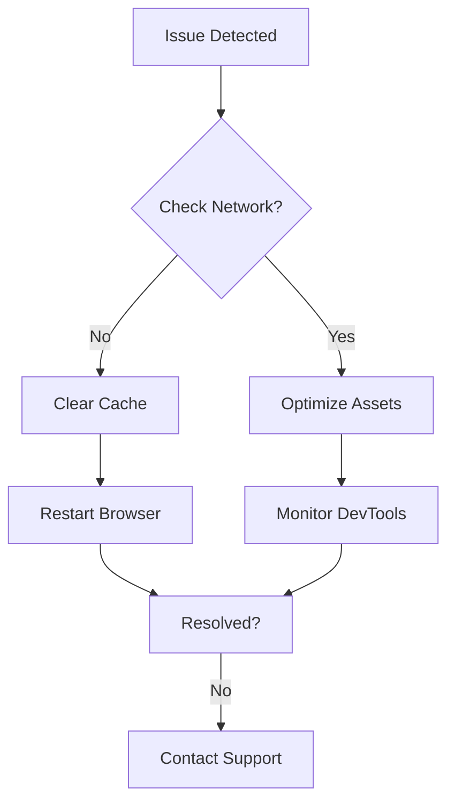

## Common Issues

Eyuel Documentation provides tools to manage your project docs efficiently. You may encounter issues like login problems, editing errors, slowdowns, or integration failures. Use the sections below to diagnose and fix them quickly.

<Columns cols={2}>
  <Card title="Login Problems" icon="user-x" href="#login-problems">
    Can't access your account? Follow these steps.
  </Card>
  <Card title="Editing Errors" icon="edit-3" href="#editing-errors">
    Pages not saving? Check common fixes.
  </Card>
  <Card title="Performance Slowdowns" icon="loader-2" href="#performance">
    Slow loading times? Optimize your setup.
  </Card>
  <Card title="Integration Failures" icon="link-2" href="#integrations">
    Third-party tools not working? Troubleshoot connections.
  </Card>
</Columns>

## Login and Access Problems

If you cannot log in or access pages, verify your credentials first.

<Steps>
  <Step title="Clear Browser Cache" icon="trash-2">
    Open your browser settings and clear cache and cookies for the last 24 hours.
  </Step>
  <Step title="Check Network" icon="wifi-off">
    Ensure you connect to a stable internet. Test with `ping api.eyuel.com`.
  </Step>
  <Step title="Reset Password" icon="key-round">
    Visit the login page and click "Forgot Password". Check your email for the reset link.
  </Step>
</Steps>

<Callout kind="tip">
  Enable two-factor authentication (2FA) after resolving issues for added security.
</Callout>

## Page Editing Errors

Editing fails due to syntax issues or conflicts. Test changes in preview mode first.

<Tabs>
  <Tab title="Markdown Syntax" icon="code">
    Common errors include unclosed backticks or invalid frontmatter.
    
    <CodeGroup tabs="Before,After">
    ````markdown
    ---
    title: Test
      description: Missing ---
    ````
    
    ```markdown
    ---
    title: Test
    description: Fixed
    ---
    ```
    </CodeGroup>
  </Tab>
  <Tab title="Component Issues" icon="alert-triangle">
    Ensure JSX components close properly.
    
    <CodeGroup tabs="Wrong,Correct">
    ````jsx
    <Card title="Title" href="#">Content
    ````
    
    ```jsx
    <Card title="Title" href="#">
    
      Content
    
    </Card>
    ```
    </CodeGroup>
  </Tab>
</Tabs>

## Performance Slowdowns

Slow performance often stems from large images or unoptimized code.

<Expandable title="Advanced Diagnostics" default-open="false">
  Run browser dev tools to check network requests exceeding `>2s`.
  
  | Symptom          | Possible Cause       | Quick Fix                  |
  |------------------|----------------------|----------------------------|
  | Slow page loads  | Large images         | Compress to `<100KB`      |
  | Editor lag       | Many components      | Use `<Columns cols={2}>`  |
  | Build failures   | Invalid MDX syntax   | Validate with linter       |
</Expandable>

<Steps>
  <Step title="Optimize Images" icon="image">
    Resize images to `width="800"` max. Use tools like ImageOptim.
  </Step>
  <Step title="Reduce Components" icon="minimize-2">
    Limit to 5-8 per page. Avoid deep nesting.
  </Step>
</Steps>



## Integration Failures

Integrations like GitHub or Slack fail due to invalid tokens.

<Callout kind="alert" icon="alert-triangle">
  Never commit real secrets. Use `YOUR_API_KEY` placeholders.
</Callout>

<CodeGroup tabs="GitHub,Slack">
```javascript
// GitHub webhook setup
const webhookUrl = 'https://api.eyuel.com/webhooks/github';
const token = 'YOUR_GITHUB_TOKEN';
```
```javascript
// Slack integration
const slackUrl = 'https://hooks.slack.com/services/YOUR/SLACK/WEBHOOK';
fetch(slackUrl, { method: 'POST', body: JSON.stringify({ text: 'Update' }) });
```
</CodeGroup>

Verify tokens in settings. Test with:

```bash
curl -H "Authorization: Bearer YOUR_TOKEN" https://api.eyuel.com/ping
```

If issues persist, check <a href="https://status.eyuel.com" target="_blank">status page</a> or contact support@eyuel.com.